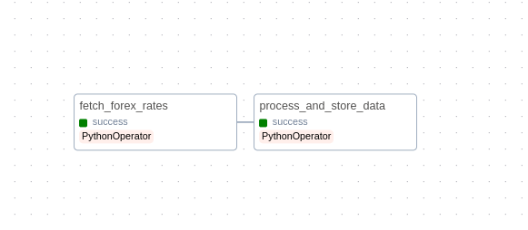

# Real-time Forex Data Pipeline

## Project Overview
A data pipeline project that fetches real-time currency exchange rates from [Alpha Vantage API](https://www.alphavantage.co), processes the data, and stores it in Snowflake data warehouse. The pipeline is orchestrated using Apache Airflow and can also be run in Docker containers.

## Features
- Real-time forex data fetching
- Historical data collection
- Data processing and cleaning
- Snowflake data warehouse integration
- Local storage fallback (JSON/CSV)
- Apache Airflow task scheduling
- Docker containerization
- Support for multiple currency pairs
- Rate viewing utility

## Project Structure
```
Real-time-Data-Pipeline/
├── config/                    # Configuration files
│   └── config.json           # API keys and settings
├── dags/                     # Airflow DAGs
│   └── dags/
│       └── forex_pipeline_dag.py
├── data_ingestion/           # Data fetching modules
│   ├── fetch_data.py         # API and mock data functions
│   ├── fetch_historical_data.py # Historical data fetching
│   ├── cleanup.py            # Data cleanup utilities
│   └── __init__.py
├── data_storage/             # Data storage operations
│   ├── save_to_snowflake.py  # Snowflake integration
│   ├── simplified_storage.py # Local storage fallback
│   └── test.sql              # SQL test queries
├── data/                     # Data storage for all files
├── logs/                     # Log files
├── tests/                    # Test cases
├── .env                      # Environment variables
├── Dockerfile                # Docker configuration
├── docker-compose.yaml       # Docker compose configuration
├── view_rates.py             # Utility to view latest rates
└── requirements.txt          # Python dependencies
```

## Technologies Used
- Python 3.9
- Apache Airflow 2.7.1
- Snowflake
- Alpha Vantage API
- Docker
- Pandas & NumPy

## How It Works
1. **Data Collection**: Fetches from API or generates mock data
2. **Processing**: Validates and transforms the data
3. **Storage**: Saves to Snowflake or local files depending on availability

## Setup and Usage

### Prerequisites
- Python 3.9+
- Docker (optional)
- Snowflake account (optional)

### Installation
1. Clone the repository
2. Install dependencies:
   ```bash
   pip install -r requirements.txt
   ```
3. Configure your environment variables in `.env` file

### Running the Pipeline
You can run the pipeline in different modes:

**View Latest Rates**:
```bash
python view_rates.py
```

**With Docker**:
```bash
docker-compose up
```

**With Airflow**:
The Airflow webserver will be available at http://localhost:8080

## Error Handling
- API rate limits → automatic mock data
- Snowflake unavailable → local CSV/JSON storage
- Data validation issues → proper error reporting

## Working With API Limits
The Alpha Vantage free tier has a 25 requests/day limit.
The pipeline detects rate limits and automatically switches to mock data.

## Snowflake Integration
The pipeline creates the following in Snowflake:
- Database (if not exists)
- Schema (if not exists)
- FOREX_RATES table with columns:
  - from_currency
  - to_currency
  - exchange_rate
  - last_refreshed
  - timestamp
  - inserted_at

## Pipeline Architecture

### Snowflake Compute Warehouse
The pipeline uses a dedicated compute warehouse in Snowflake:


`COMPUTE_WH` - The Snowflake compute warehouse that powers all data processing operations.

### Snowflake Data Flow
The data pipeline follows this architecture in Snowflake:

1. `FOREX_STAGE` - Initial data ingestion stage
2. `FOREX_RATES_STAGE` - Transformation stage before loading to final table
3. `FOREX_RATES` - Final table for storing the processed data

### Airflow DAG
The Airflow DAG consists of two main tasks:



1. `fetch_forex_rates` - Python operator that fetches data from Alpha Vantage API
2. `process_and_store_data` - Python operator that processes and stores data in Snowflake
