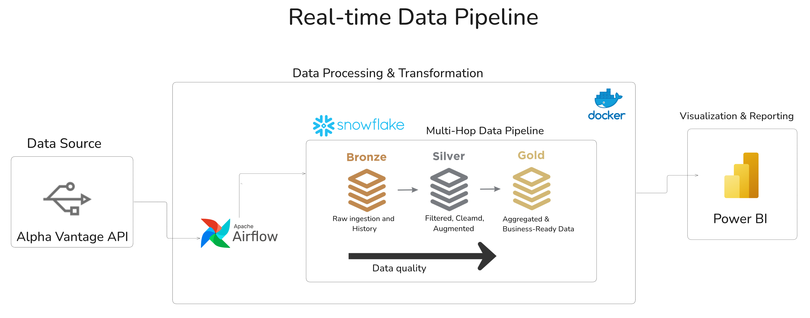
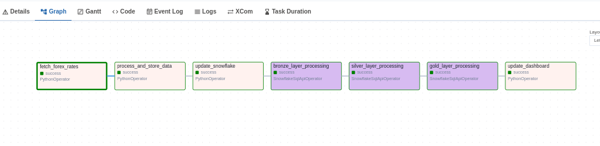

# Real-time Forex Data Pipeline

## Overview

A comprehensive data analytics engineering solution that fetches, processes, and analyzes real-time currency exchange rates. The pipeline ingests data from the Alpha Vantage API, processes it through a multi-stage ETL workflow, and stores it in a Snowflake data warehouse. The entire process is orchestrated using Apache Airflow with full monitoring and error handling.

## Pipeline Architecture

 


## Key Features

- **Real-time Data Ingestion**: Automated fetching of currency exchange rates from Alpha Vantage API
- **Historical Data Analysis**: Collection and processing of historical forex data
- **ETL Pipeline**: Multi-layer data transformation (bronze, silver, gold)
- **Data Warehouse**: Snowflake integration with optimized schema design
- **Workflow Orchestration**: Apache Airflow DAGs with dependency management
- **Containerization**: Docker setup for consistent development and deployment
- **Interactive Visualization**: Streamlit dashboards for real-time data analysis
- **Multi-currency Support**: Handles multiple currency pairs (EUR/USD, EUR/EGP, USD/EGP)
- **Error Handling**: Robust logging and fallback mechanisms

## Architecture

The data pipeline follows a modern data analytics engineering architecture:

1. **Data Ingestion Layer**: Python scripts connect to Alpha Vantage API and fetch forex data
2. **Processing Layer**: ETL processes transform raw data
3. **Storage Layer**: Processed data is stored in Snowflake data warehouse
4. **Orchestration Layer**: Apache Airflow manages the entire workflow
5. **Visualization Layer**: Streamlit dashboards for data analysis and monitoring

### Data Flow
```
API Source → Data Ingestion → Data Processing → Snowflake DWH → Analytics Dashboard
```

## Technology Stack

- **Programming**: Python 3.9+
- **Orchestration**: Apache Airflow 2.7.1
- **Data Warehouse**: Snowflake
- **Data Processing**: Pandas, NumPy
- **API Integration**: Requests, Alpha Vantage API
- **Containerization**: Docker, Docker Compose
- **Visualization**: Streamlit, Plotly, Power BI
- **Database Connectivity**: SQLAlchemy, Snowflake Connector
- **Development**: Pytest, Black, Flake8


## Dashboard

The project includes interactive Streamlit dashboards for data visualization and analysis.

### Live Demo
**[View Live Dashboard](https://anwaribra-real-time-data-pipeline-dashboard-93ffoi.streamlit.app/)**

### Features
- Candlestick charts for forex price movements
- Technical indicators (Moving Averages, RSI, MACD)
- Volatility analysis
- Currency pair comparisons
- Data export capabilities


## Snowflake Integration

The pipeline leverages Snowflake's cloud data warehouse capabilities.

### Architecture
- **Database**: FOREX_DATA
- **Schemas**: PUBLIC, BRONZE, SILVER, GOLD
- **Main Tables/Views**:
  - FOREX_RATES - Raw exchange rate data
  - FOREX_RATES_ANALYTICS - Processed analytical data
  - VOLATILITY_METRICS - Volatility aggregations
  - TECHNICAL_ANALYSIS - Technical indicators
  


## Airflow DAG
The Airflow DAG consists of seven main tasks:



1. `fetch_forex_rates` - Python operator that fetches data from Alpha Vantage API
2. `process_and_store_data` - Python operator that processes and stores data
3. `update_snowflake` - Updates Snowflake with new data
4. `bronze_layer_processing` - Processes raw data in Snowflake
5. `silver_layer_processing` - Transforms and validates data
6. `gold_layer_processing` - Creates analytics tables
7. `update_dashboard` - Updates the dashboard with latest data
